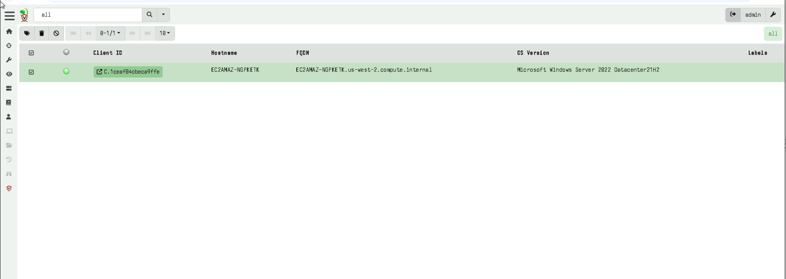

# Endpoint Forensics and Threat Hunting Lab

## Velociraptor + Splunk Enterprise

This project demonstrates endpoint monitoring, artifact collection, and threat hunting using Velociraptor and Splunk Enterprise. A Windows Server 2022 endpoint hosted on AWS EC2 was enrolled into Velociraptor, monitored remotely, and integrated with Splunk for centralized log collection and analysis.

The objective of this lab was to gain hands-on experience with endpoint visibility, process analysis, PowerShell monitoring, and SIEM-based threat hunting workflows.

---

## Skills Demonstrated

* Endpoint Detection and Response (EDR)
* Velociraptor deployment and client enrollment
* Artifact collection and analysis
* VQL (Velociraptor Query Language)
* Process hierarchy analysis
* Splunk Enterprise administration
* Windows Event Log analysis
* PowerShell monitoring
* Threat hunting
* Security Operations Center (SOC) workflows
* Endpoint telemetry investigation

---

## Tools Used

| Tool                       | Purpose                                     |
| -------------------------- | ------------------------------------------- |
| Velociraptor               | Endpoint monitoring and artifact collection |
| Splunk Enterprise          | SIEM and log analysis                       |
| Splunk Universal Forwarder | Windows log forwarding                      |
| AWS EC2                    | Remote Windows Server environment           |
| Windows Server 2022        | Endpoint under investigation                |
| PowerShell                 | Administration and event generation         |
| VQL                        | Endpoint artifact querying                  |

---

## Lab Architecture

The lab consisted of:

* Local Velociraptor Server
* AWS EC2 Windows Server 2022 Endpoint
* Splunk Enterprise Instance
* Splunk Universal Forwarder

The Windows endpoint was enrolled into Velociraptor and configured to forward logs into Splunk Enterprise for centralized analysis.

---

## Endpoint Enrollment

The Windows Server endpoint was successfully enrolled into Velociraptor and maintained an active connection to the server.



This provided remote visibility into endpoint activity and allowed forensic artifacts to be collected directly from the system.

---

## Artifact Collection

Velociraptor was used to execute the `Windows.System.Pslist` artifact to collect process information from the endpoint.


The artifact returned information including:

* Process Names
* Process IDs (PIDs)
* Parent Process IDs (PPIDs)
* Command Line Arguments
* Running System Processes

This provided a baseline view of active processes on the endpoint.

---

## Process Hierarchy Analysis with VQL

A Velociraptor notebook was used to analyze process relationships using VQL.


Parent-child process relationships were examined to understand normal operating system behavior and identify potentially suspicious execution chains.

Examples observed included:

* System
* Registry
* smss.exe
* csrss.exe
* wininit.exe
* services.exe
* lsass.exe

Understanding process lineage is an important skill for endpoint investigations and threat hunting.

---

## PowerShell Threat Hunting with Splunk

PowerShell Operational logs were forwarded into Splunk and analyzed using Event ID 4104.

```spl
sourcetype="WinEventLog:Microsoft-Windows-PowerShell/Operational" EventCode=4104
```


Event ID 4104 captures PowerShell Script Block Logging, which allows analysts to review executed PowerShell commands and identify potentially malicious activity.

Examples observed during the lab included administrative commands and remote execution activity generated from Velociraptor collections.

---

## Key Findings

* Successfully enrolled a remote Windows Server endpoint into Velociraptor.
* Collected endpoint process artifacts using Windows.System.Pslist.
* Analyzed process hierarchy using VQL notebooks.
* Forwarded Windows event logs into Splunk Enterprise.
* Queried PowerShell Operational logs using Event ID 4104.
* Practiced endpoint-focused threat hunting techniques.
* Improved understanding of endpoint telemetry and forensic workflows.

---

## What I Learned

This project strengthened my understanding of endpoint visibility and incident investigation workflows. By combining Velociraptor's artifact collection capabilities with Splunk's search and analytics features, I gained hands-on experience identifying and analyzing endpoint activity from both an EDR and SIEM perspective.

The most valuable takeaway was learning how process artifacts and PowerShell telemetry can be leveraged to investigate system activity and support threat hunting efforts.

---

## Repository Contents

* Velociraptor deployment screenshots
* Artifact collection examples
* VQL notebook analysis
* Splunk threat hunting queries
* Supporting documentation and writeups
